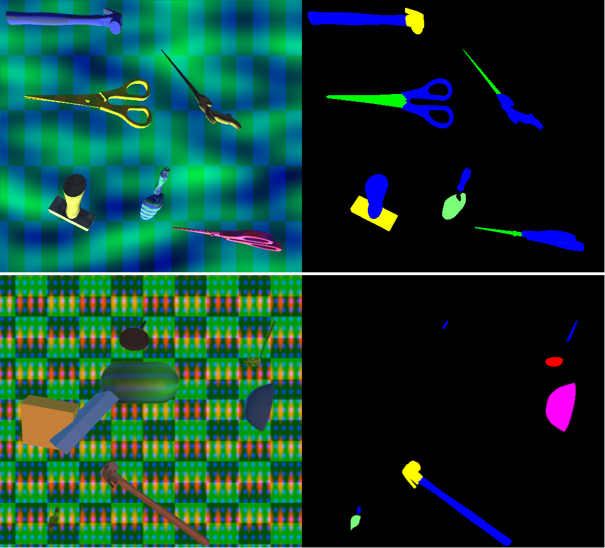
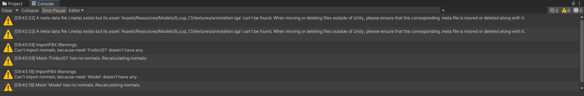

# Introduction
This repository contains the implementation of the synthetic dataset generator for the affordance segmentation in our paper "Learning to Segment Object Affordances on Synthetic Data for Task-oriented Robotic Handovers". The generator was build using the Unity game engine, and the repository itself is the Unity project and, therefore, has be to launched and modified within the Unity editor. The figure bellow shows the sample of the images that the generator produces.



The pictures on the left are the RGB images, the pictures on the right are the corresponding annonated masks. With addition to masks, the generator also outputs a class label and a bounding box for each rendered object.

The generated dataset including the ground truth is saved in the **dataset/train** folder within the project folder.

# Affiliated repositories
The AffNet-DR network can be found here: https://github.com/HuchieWuchie/affnetDR
The ROS node implementation for the Little Helper robot can be found here: https://github.com/HuchieWuchie/affnetDRROS

# Installation guide
This software was tested with Unity Editor version 2020.3.26f1 on both Windows 10 and Ubuntu 18.04.

## 1. Download this repository
```
git clone https://github.com/HuchieWuchie/affordanceSynthetic.git
```

## 2. Download the models
In order to use this generator, you must first download the annotated models from the following link: https://drive.google.com/drive/folders/1k9gZXCKIrNwlfj3wfRI7sB72yN8cxc85?usp=sharing

After the download is completed, extract the zip file, and place the **Models** folder within the project's **Assets/Resources** folder.

## 3. Open the project using Unity Hub
It may take some time to import all the models. Some warnings regarding normals will pop up in the Unity console window the first time you import the models, see the picture bellow. These should be disregarded and will disappear next time you open the project.


After the project opens, perform the following steps:
  - Load **SampleScene**
    - The file can be found in the **Assets/Scenes** folder
  - Connect the **scenemanager game object**  with the **scenemanager script**

## 4. Build and run the project
**IMPORTANT - do not just press *Play* button.** This will not work. Build and run the project using the **Ctrl + B** shortcut or by selecting **Build and Run** option from **the *File* drop-down menu**

# Authors
Albert Christensen, Department of Electronic Systems, Aalborg University<br/>
Daniel Lehotsky, Department of Electronic Systems, Aalborg University<br/>
Project supervisor - Dimitris Chrysostomou, Robotics & Automation Group, Department of Materials and Production, Aalborg University
